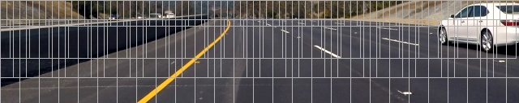
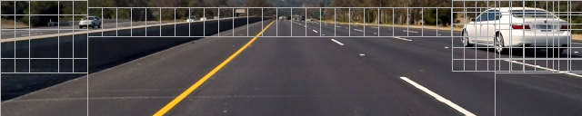
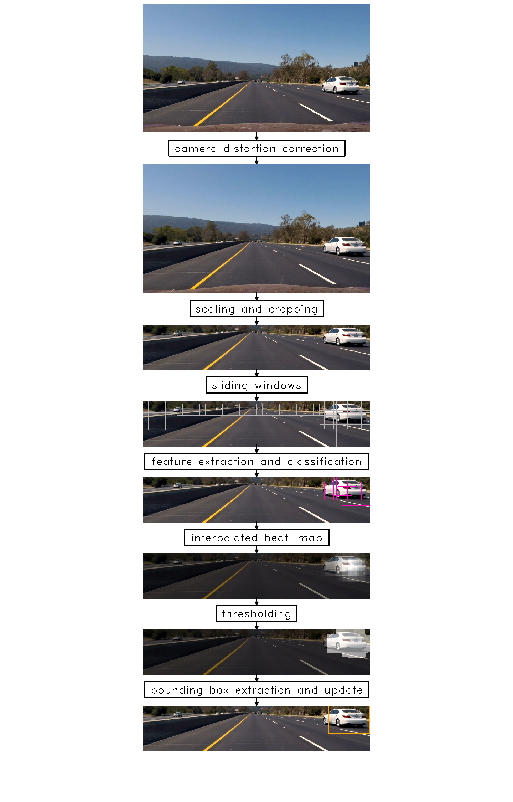

## Udacity CarND Project 5: Vehicle Detection and Tracking

### 1. Histogram of Oriented Gradients (HOG)
#### 1.1. Feature Extraction
Feature extraction is performed in the module ```extract_features.py``` in function ```extract_features```. I chose the YUV color space for the basis of feature extraction
as it separates the brightness or luminance information from the color information very
similar to human perception. My hypothesis was that just using the luminance channel would
be enough to train a classifier for car detection but false positive rate proved to be
too high in this case. Consequently, the following features are extracted for training and prediction:

* HOG features for channels Y, U, and V with:
    * eight directions
    * 16 pixels per cell (for a window size of 64x64 pixels)
    * 2 cells per block
* spatial binning for channels Y, U, and V with 16x16 bins
* color histogram for channels Y, U, and V with 32 bins

The relatively high value of 16 pixels per cell for the HOG calculation was chose for two
reasons: The first is reducing the number of total features as far as possible in order
to improve prediction performance. The second is the use of multiple classifiers for
windows of different sizes, also in order to improve performance of the sliding window
pipeline. For smaller window sizes, the number of pixels per cell is reduced proportionally,
leading to a value of two for a 16x16 pixel window.

#### 1.2. SVM Classifier
In order to optimize performance of the sliding window pipeline instead of training one
classifier for a fixed window size, a whole phalanx of classifiers for window sizes between 64 and 16 pixels are trained.
In this way, windows of different sizes do not need to be rescaled during the sliding window
search, which improves performance significantly.

Training of the classifiers is done in ```train_classifier.py```. First the vehicle and non-vehicle images are loaded scaled to one of the predefined window sizes (64, 56, 52, 48, 44, 40, 36, 32, 28, 24, 20, 16). Then, as a simple data augmentation step, horizontally
flipped versions of the images are added. Finally, the images are converted to YUV
color space and the feature vectors are extracted as described above. In order to speed up feature extractions, multiple threads are utilized.

For training, the data is split into a training and a test set and a ```StandardScaler``` is fitted to the training data. Then a ```LinearSVC``` classifier is fitted to the normalized training
data. As classifiers for twelve different window sizes are fitted, this training step is also done using multiple threads in order to shorten training time.

The resulting classifiers have a validation accuracy between 97.64% for 16x16 pixel windows and 99.19% for 64x64 pixel windows. The SVM classifiers and the StandardScalers are
inserted into dictionaries with the window size as key and saved in a python pickle for
later consumption of the vehicle detector.

### 2. Sliding Window Search
I skipped working on still images and focussed on working on a realtime render of the video instead. A flow chart of the whole pipeline can be seen below. The code for detecting
vehicles is contained in the class `VehicleDetector`.
In order to optimize for speed, the frame is first scaled down by a factor of four and cropped to only the area of interest.

#### 2.1 Sliding Window Algorithm
When implementing a sliding window algorithm in a grid-like pattern, as show below, there are two conflicting goals: On the one hand we would like to increase the number of windows in order two achieve a high spacial resolution which would allow for accurate vehicle localization and tightly fitting bounding boxes. There also have to be a wide range of different window sizes in order to detect
vehicles at different distances. The high number of required windows in the whole frame of interest will unfortunately lead to a severe increase of processing time per frame. Also, the number of false positive detections will increase which makes the subsequent
vehicle detection and tracking less robust (`VehicleDetector.sliding_windows`).



After experimenting with a grid-like sliding window algorithm and not achieving good performance, I changed the scanning pattern into a two part strategy: In order to detect new cars, only those areas are scanned where cars will enter the frame (`VehicleDetector.scan_edges`). These are the left
and right edges for cars that come from behind, as well as a strip toward the horizon which will capture cars as we catch up with them. When a car enters the frame from one of the sides, it will cover a relatively large area, which is reflected in bigger windows at these edges (window sizes from top to bottom: 32x32, 48x48 pixels). Cars that appear on the
(near) horizon in contrast will have a relatively small apparent size and are scanned
by smaller windows (16x16 pixels).



Once a car has been detected, its bounding box is scanned by an additional sliding window
algorithm (`VehicleDetector.scan_vehicle_bboxes`). First, a window size is chosen that is slightly less than the bounding box height (`VehicleDetector.window_size_for_rect`). This helps to keep the subsequent bounding boxes as tightly fitting as possible.
The window is then moved across the bounding box with a relatively small step size (one
  fourth of the window size in both x and y), while overlapping the bounding box by a margin in both the horizontal and the vertical direction. The margin is necessary to allow for the growing
  of the bounding box shortly after detection (when it still may be small) and when the
  detected car gets closer to the camera.
As a final step, a window is added with the same size of the bounding box which is rescaled
to a square window. This allows for better detection of cars at oblique angles.

This approach has a number of advantages in comparison to a grid-like sliding window approach:

* The total amount of scanned windows is greatly reduced leading to higher detection speed.
* The algorithm will search in the vicinity of the last detection with a high spatial
    resolution leading to a more robust tracking over time.
* The search windows are centered on the last known position of the car which will allows for smaller windows during scanning (without missing the car) and consequently tighter bounding boxes.
* Not scanning areas of the image that likely do not contain cars reduces the number
    of false positives produced by the classifier.


#### 2.2 Pipeline



### 3. Video Implementation
#### 3.1 Final Video
Rendered video combined with lane detection:
https://youtu.be/dhc1NyVLd1o

Realtime detection running at 12-18 fps on a MacBook Pro i7:
https://youtu.be/6N3RZl-NYNs

#### 3.2 False Positive Suppression and Vehicle Tracking
False positives are suppressed by a combination of three measures: First, the sliding window algorithm selectively searches in the bounding boxes of the last known vehicles and
at the edges of the frame of interest, as described above. This already reduces the number
of false positives generated.

The second measure is the use of a low-pass filtered heat map
(class `HeatMap`). Every positively classified window is added to the heat map of the current frame (`HeatMap.add_detections`) which is then averaged with the existing heat map
(`HeatMap.update_map`). The resulting low-pass filtered map is then thresholded which only
leaves the "hot" areas where several detections where registered in the last video frames.
Finally, bounding box candidates are extracted using `scipy.ndimage.measurements.label` in
`HeatMap.get_bboxes`.

The third measure to suppress false positives is contained in the class `VehicleDetection`
that tracks detected cars over consecutive video frames. If a new bounding box is found,
a new instance of `VehicleDetection` is added to a list of known detections. This new detection is first kept in a provisional state and only becomes active
when a number of bounding boxes have been found in its area over several video frames. If, however, no further detections are found in the bounding box of the new detection, it is discarded.

Bounding boxed from the thresholded heat map that do overlap with a known detection, are used to update the current position and size of the respective `VehicleDetection` instance (`VehicleDetection.update`). In order to produce detections that are more stable over time,
both the position and the size are low-pass filtered over time.

#### 4. Discussion
Possible points of failure:
* Cars that go into the other direction are not detected. This could be very problematic on country roads where the driving directions are not separated. Maybe the video would need a higher frame rate for a robust detection in this case and the speed of the detection algorithm would need to be further improved.
* Different lighting and weather conditions will make detection less robust.

Possible improvements:
* Interpolate position and size of tracked vehicle bounding boxes using a Kalman filter to further optimize the search area in the next video frame.
