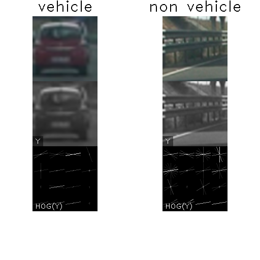

## Udacity CarND Project 5: Vehicle Detection and Tracking
### 0. Instructions
Dependencies:

* OpenCV
* numpy
* sklearn
* skimage
* pyglet

The main script is `detect_vehicles.py` which will open a pyglet window and start processing the `project_video.mp4`. When the flag `--render` is added, the output is
rendered to `project_video_annotated.mp4`. The flag `--frame-skip NUM_FRAMES` will
tell the pipeline to skip sliding windows for NUM_FRAMES and interpolate detected
bounding boxes for these frames. The flag `-s` specifies the down-scaling factor used
(default is 4, values of 1,2 and 4 have been tested.) Lane detection can be
disabled with `--no-lane-lines` and some annotations added using `--annotate`.

The classifiers are trained with the script `train_classifier.py` which needs the
directories `vehicles` and `non-vehicles` as input (not provided). It will also
look for additional images in directories starting with `false_positives`.


### 1. Histogram of Oriented Gradients (HOG)
#### 1.1. Feature Extraction
Feature extraction is performed in the module ```extract_features.py``` in function ```extract_features```. I chose the YUV color space for the basis of feature extraction
as it separates the brightness or luminance information from the color information very
similar to human perception. My hypothesis was that just using the luminance channel would
be enough to train a classifier for car detection but false positive rate proved to be
too high in this case. Consequently, the following features are extracted for training and prediction:

* HOG features for channels Y, U, and V with:
    * eight directions
    * 16 pixels per cell (for a window size of 64x64 pixels)
    * 2 cells per block
* spatial binning for channels Y, U, and V with 16x16 bins
* color histogram for channels Y, U, and V with 32 bins

The relatively high value of 16 pixels per cell for the HOG calculation was chose for two
reasons: The first is reducing the number of total features as far as possible in order
to improve speed of prediction. The second is the use of multiple classifiers for
windows of different sizes, also in order to improve performance of the sliding window
pipeline. For smaller window sizes, the number of pixels per cell is reduced proportionally,
leading to a value of two for a 16x16 pixel window. Examples of extracted HOG features
of the Y channel are shown below for a vehicle and a non-vehicle image.



#### 1.2. SVM Classifier
In order to optimize performance of the sliding window pipeline instead of training one
classifier for a fixed window size, a whole phalanx of classifiers for window sizes between 64 and 16 pixels is trained.
In this way, windows of different sizes do not need to be rescaled during the sliding window
search, which improves performance significantly.

Training of the classifiers is done in ```train_classifier.py```. First the vehicle and non-vehicle images are loaded and scaled to one of the predefined window sizes (64, 56, 52, 48, 44, 40, 36, 32, 28, 24, 20, 16). Then, as a simple data augmentation step, horizontally
flipped versions of the images are added. Finally, the images are converted to YUV
color space and the feature vectors are extracted as described above. In order to speed up feature extractions, multiple threads are utilized.

For training, the data is split into a training and a test set and a ```StandardScaler``` is fitted to the training data. Then a ```LinearSVC``` classifier is fitted to the normalized training
data. As classifiers for twelve different window sizes are fitted, this training step is also done using multiple threads in order to shorten training time.

The resulting classifiers have a validation accuracy between 97.64% for 16x16 pixel windows and 99.19% for 64x64 pixel windows. The SVM classifiers and the StandardScalers are
inserted into dictionaries with the window size as key and saved in a python pickle for
later consumption of the vehicle detector.

### 2. Sliding Window Search
I skipped working on still images and focussed on working on a realtime render of the video instead. A flow chart of the whole pipeline can be seen below. The code for detecting
vehicles is contained in the class `VehicleDetector`.
In order to optimize for speed, the frame is first scaled down by a factor of four and cropped to only the area of interest.

#### 2.1 Sliding Window Algorithm
When implementing a sliding window algorithm in a grid-like pattern, as show below, there are two conflicting goals: On the one hand we would like to increase the number of windows in order two achieve a high spacial resolution which would allow for accurate vehicle localization and tightly fitting bounding boxes. There also have to be a wide range of different window sizes in order to detect
vehicles at different distances. The high number of required windows in the whole frame of interest will unfortunately lead to a severe increase of processing time per frame. Also, the number of false positive detections will increase which makes the subsequent
vehicle detection and tracking less robust (`VehicleDetector.sliding_windows`).


After experimenting with a grid-like sliding window algorithm and not achieving fast performance, I changed the scanning pattern into a two part strategy: In order to detect new cars, only those areas are scanned where cars will enter the frame (`VehicleDetector.scan_edges`). These are the left
and right edges for cars that come from behind, as well as a strip toward the horizon which will capture cars as we catch up with them. When a car enters the frame from one of the sides, it will cover a relatively large area, which is reflected in bigger windows at these edges (window sizes from top to bottom: 32x32, 48x48 pixels). Cars that appear on the
(near) horizon in contrast will have a relatively small apparent size and are scanned
by smaller windows (16x16 pixels).


Once a car has been detected, its bounding box is scanned by an additional sliding window
algorithm (`VehicleDetector.scan_vehicle_bboxes`). First, a window size is chosen that is slightly less than the bounding box height (`VehicleDetector.window_size_for_rect`). This helps to keep the subsequent bounding boxes as tightly fitting as possible.
The window is then moved across the bounding box with a relatively small step size (one
  fourth of the window size in both x and y), while overlapping the bounding box by a margin in both the horizontal and the vertical direction. The margin is necessary to allow for the growing
  of the bounding box shortly after detection (when it still may be small) and when the
  detected car gets closer to the camera.
As a final step, a window is added with the same size of the bounding box which is rescaled
to a square window. This allows for better detection of cars at oblique angles.

This approach has a number of advantages in comparison to a grid-like sliding window approach:

* The total amount of scanned windows is greatly reduced leading to higher detection speed.
* The algorithm will search in the vicinity of the last detection with a high spatial
    resolution leading to a more robust tracking over time.
* The search windows are centered on the last known position of the car which allows for smaller windows during scanning (without missing the car) and consequently tighter bounding boxes.
* Not scanning areas of the image that likely do not contain cars reduces the number
    of false positives produced by the classifier.


#### 2.2 Pipeline and Improvement of Classifier Reliability
A flow chart of the complete pipeline is shown below. It shows an example for a successful
car detection. After correcting the camera distortion, the frame is scaled down by
a factor of four and cropped to the area of interest that may potentially contain cars.
Then window coordinates are generated for scanning the edges of the view and the
bounding boxes of tracked cars. For these windows, the HOG and color features are
extracted and the resulting vectors are normalized and passed to the LinearSVC classifier
with matching input size (one of 12 different classifiers). The positive windows are
added to a low-pass filtered heat map, which is thresholded in order to extract bounding
box candidates. The bounding boxes are then used to either update one of the tracked vehicle detections or represent new ones.


In order to improve the reliability of the SVM classifier, I experimented with different
features. I first started with just extracting the HOG features of the Y channel with mixed results. I then added HOG features for the U and V channel and color histograms and spatial
binning to the feature vector which improved the accuracy of the classifiers. Finally, I did several rounds of hard negative mining by saving and hand sorting false positives that
were generated during a pass through the project video. With these additional training
images I finally trained classifiers that gave acceptable results.


### 3. Video Implementation
#### 3.1 Final Video
##### 3.1.1 Rendered Video Combined with Lane Detection.
A video of the vehicle detection and tracking pipeline together with lane detection is
shown in the link below (click to watch). The whole pipeline runs at 6-8 fps with lane detection and at 8-10 fps without lane detection on a MacBook Pro 2015 i7.

https://youtu.be/dhc1NyVLd1o

[](http://www.youtube.com/watch?v=dhc1NyVLd1o)

##### 3.1.2 Realtime Detection with Frame Skipping
The video below shows a realtime capture of the vehicle detection running on
a MacBook Pro i7 at 12-18 fps. In order to further increase performance, the sliding window
detection pipeline is only run once in every three frames. In the intervening frames the
position and size of tracked vehicle bounding boxes are interpolated.

https://youtu.be/6N3RZl-NYNs

[](http://www.youtube.com/watch?v=6N3RZl-NYNs)


#### 3.2 False Positive Suppression and Vehicle Tracking
False positives are suppressed by a combination of three measures: First, the sliding window algorithm selectively searches in the bounding boxes of the last known vehicles and
at the edges of the frame of interest, as described above. This already reduces the number
of false positives generated.

The second measure is the use of a low-pass filtered heat map
(class `HeatMap`). Every positively classified window is added to the heat map of the current frame (`HeatMap.add_detections`) which is then averaged with the existing heat map
(`HeatMap.update_map`). The resulting low-pass filtered map is then thresholded which only
leaves the "hot" areas where several detections where registered in the last video frames.
Finally, bounding box candidates are extracted using `scipy.ndimage.measurements.label` in
`HeatMap.get_bboxes`.

The third measure to suppress false positives is contained in the class `VehicleDetection`
that tracks detected cars over consecutive video frames. If a new bounding box is found,
a new instance of `VehicleDetection` is added to a list of known detections. This new detection is first kept in a provisional state and only becomes active
when a number of bounding boxes have been found in its area over several video frames. If, however, no further detections are found in the bounding box of the new detection, it is discarded.

Bounding boxed from the thresholded heat map that do overlap with a known detection, are used to update the current position and size of the respective `VehicleDetection` instance (`VehicleDetection.update`). In order to produce detections that are more stable over time,
both the position and the size are low-pass filtered over time.

### 4. Discussion
During the course of this project I focussed on attaining near realtime performance.
To summarize, the following strategies were applied to reach this goal:

* Scaling down the camera image by a factor of four and cropping to only the narrow area
that will contain vehicles.
* Using a phalanx of 12 SVM classifiers with different window sizes in order to avoid
rescaling of windows during predictions.
* Selective sliding window strategy that scans only the edges of the field of vision and
the bounding boxes of tracked vehicles.
* Optional skipping of video frames with interpolation of position and size of tracked vehicle bounding boxes.

I presume that in an implementation for a production system there would be dedicated hardware for this task, either in the form of an FPGA for fast HOG feature extraction and
classification, or in form of a GPU in conjunction with a fast deep learning approach to this problem. I was surprised that even on a fast i7 CPU it was very hard to reach realtime
performance.


#### 4.1 Possible Points of Failure:
* Cars that go into the other direction are not detected. This could be very problematic on country roads where the driving directions are not separated. Maybe the video would need a higher frame rate for a robust detection in this case and the speed of the detection algorithm would need to be further improved.
* Different lighting and weather conditions will make detection less robust.
* Having a lot of vehicles, like in a traffic jam, would lead to more occlusions and would
make tracking of individual cars harder.

#### 4.2 Possible improvements:

* Interpolate position and size of tracked vehicle bounding boxes using a Kalman filter to further optimize the search area in the next video frame.
* This could also help to continue tracking of occluded cars.
